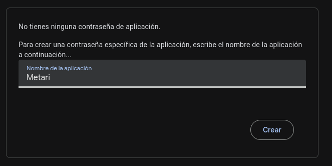
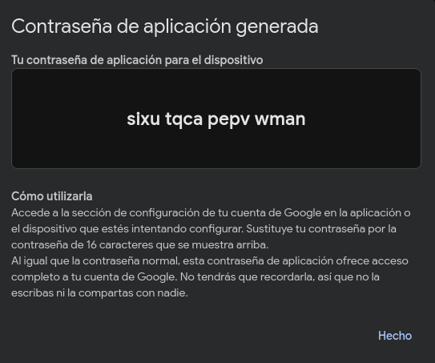
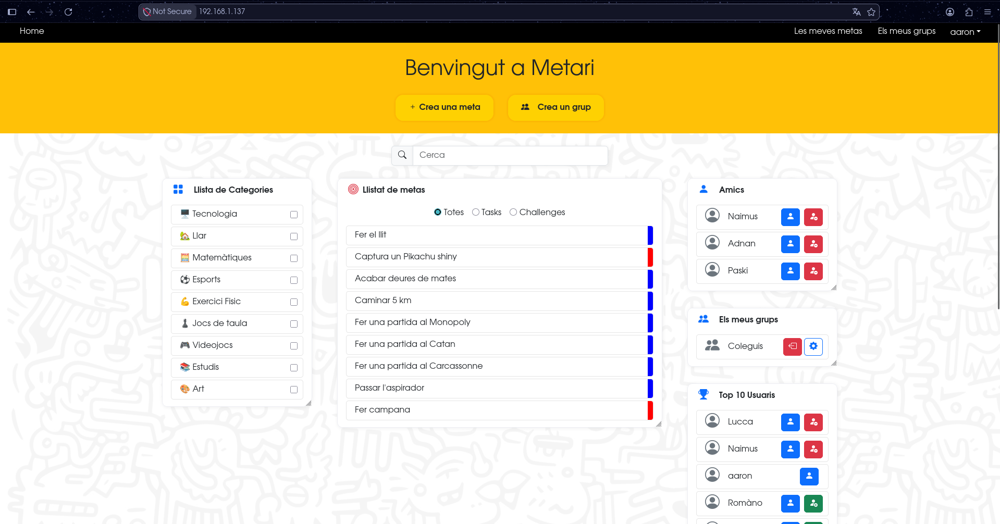

# Metari - Guia de desplegament

En aquesta guia veurem com instal·lar i posar en producció Metari dins d'un servidor.

Per a l'elaboració d'aquest manual utilitzarem com a màquina de mostra un **Ubuntu Server 24.04 LTS**, per tant, les comandes utilitzades i redactades en aquest manual estaran orientades a la màquina que utilitzarem com a mostra.

## Requisits previs

- [**Git**](https://git-scm.com/install/)
    - Consulta la teva versió (normalment ve instal·lat en la majoria de distribucions):

    ```bash
    git --version
    ```
    - Instal·lació:

    ```bash
    sudo apt install git
    ```

- [**Curl**](https://curl.se/docs/install.html)
    - Consulta la teva versió:

    ```bash
    curl --version
    ```

    - Instal·lació:

    ```bash
    sudo apt install curl
    ```

- [**Docker**](https://docs.docker.com/engine/install/)
    - Consulta la teva versió:

    ```bash
    docker --version
    ```

    - Instal·lació:

    ```bash
    curl -fsSL https://get.docker.com | sh
    ```

    - Utilitza Docker sense sudo (és més segur):

    ```bash
    sudo usermod -aG docker $USER
    ```

## Servei de correu i generació de app password (Opcional)

> **Nota:** El sistema de notificacions per correu és **opcional**. L'aplicació funciona sense aquesta configuració; només cal fer aquest pas si es volen rebre notificacions per correu electrònic o si es vol provar la restauració de contrasenya.

Metari compta amb un sistema bàsic de notificacions via correu electrònic, per a que funcioni necessitem un correu electrònic ja existent (preferiblement de **Gmail**) i generar una app password.

Per fer-ho hem d'anar al [**següent enllaç**](https://myaccount.google.com/apppasswords?rapt=AEjHL4OM_w63PzMhNjp0Pwp6UnGBYtCZE7sdark4n6IMARfu6DfpQRjLNp6fq5gk-DGlMPPRq7-eQojM67Vz1SoO0h-WE8krcHLB7kvGyhZnaSzhiCzSaqw) des del correu electrònic que vulguem utilitzar.

Una vegada estiguem dins de la pàgina podrem generar la nostra app password amb només un nom d'aplicació:



Generarà una clau similar a aquesta (la clau mostrada no funciona, només ha sigut creada per aquesta demostració):



Desa-la, ja que en la instal·lació serà utilitzada en cas de voler notificacions via correu electrònic.

Si tens problemes creant l'app password, assegura't de que el compte de Google que vols utilitzar té la **verificació en 2 passos activa** o que **l'administrador del teu Workspace no tingui les app passwords deshabilitades**.

## Instal·lació, configuració i posada en producció.

Després d'haver instal·lat els requisits previs i haver generat l'app password, anem al nostre servidor de producció i clonem el repositori:

```bash
git clone https://github.com/aaroncano2006/metari.git
```

O amb clau SSH:

```bash
git clone git@github.com:aaroncano2006/metari.git
```

Ens situem en el directori del projecte:

```bash
cd metari
```

Copiem el fitxer `.env.example` i emplenem les variables d'entorn:

```bash
cp .env.example .env
nano .env
```

Exemple:

```env
MYSQL_ROOT_PASSWORD=root
MYSQL_DATABASE=metari
```

> ⚠️ **Important:** Els valors que definiu aquí (`MYSQL_ROOT_PASSWORD` i `MYSQL_DATABASE`) s'han de reproduir exactament al fitxer `backend/.env`. Si no coincideixen, el backend no podrà connectar-se a la base de dades i donarà l'error `P1000`.

Ens situem al directori del backend i fem el mateix amb el fitxer `.env.example` que trobem:

```bash
cd backend
cp .env.example .env
nano .env
```

Dins d'aquest `.env` tenim diverses variables d'entorn, però les que ens interessen per al desplegament de l'aplicació són les següents:

- `ENVIRONMENT`: Determina en quin entorn s'executa l'aplicació (`dev` o `production`). Valor per defecte: `production` (el mantenim tal qual).

- `DOCKER_PORT`: Determina en quin port escoltarà el backend. Valor per defecte: 3001 (el mantenim tal qual).

- `DOCKER_DATABASE_URL`: Enllaç a la base de dades amb la qual es conectarà l'ORM del backend (Prisma). Valor per defecte: `mysql://root:root@db:3306/metari`. Canvia `root` (contrasenya) i `metari` (nom de BD) pels valors especificats al `.env` de l'arrel del projecte i comprova que `db` i `3306` són els mateixos valors que els de les variables `DOCKER_ADAPTER_HOST` i `DOCKER_ADAPTER_PORT`.

- `DOCKER_ADAPTER_HOST`: Host on s'ubica la base de dades. Valor per defecte: `db`. S'ha de mantenir ja que aquest és el nom del servei que conté la nostra base de dades al Docker Compose.

- `DOCKER_ADAPTER_PORT`: Port del host que conté la base de dades. Valor per defecte: 3306 (el mantenim tal qual).

- `DOCKER_ADAPTER_USER`: Usuari amb privilegis de la base de dades. Valor per defecte: root (el mantenim tal qual).

- `DOCKER_ADAPTER_PASSWORD`: Contrasenya de l'usuari amb privilegis de la base de dades. Valor per defecte: root (canvia-la pel valor especificat a la variable d'entorn de l'arrel `MYSQL_ROOT_PASSWORD`).

- `DOCKER_ADAPTER_DATABASE`: Base de dades utilitzada. Valor per defecte: metari (canvia'l pel valor especificat a la variable d'entorn de l'arrel `MYSQL_DATABASE`)

- `DOCKER_FRONTEND_URL`: URL del frontend per a producció. Serveix per restringir l'origen de les peticions i que només el frontend pugui fer peticions al backend. Valor per defecte: http://localhost (mantenir com està, és necessari per a que Docker ho entengui).

- `DOCKER_FRONTEND_URL_WITH_HOST`: URL del frontend amb host per a producció. Serveix per a que els correus enviin enllaços del frontend hostejats al servidor en comptes d'enllaços directes al propi host, ja que trencaria tota l'utilitat de les notificacions per correu electrònic. Valor per defecte: http://ip (canvia IP per la teva IP del servidor o nom de domini).

- `TRANSPORTER_SERVICE`: (Opcional) Servidor de correu que utilitzarà el servei de correu electrònic. Per defecte està buit (notificacions desactivades), però si es vol utilitzar, es recomana `gmail`.

- `TRANSPORTER_USER`: (Opcional) Correu electrònic amb el qual has creat l'app password abans.

- `TRANSPORTER_APP_PASS`: (Opcional) App password generada anteriorment.

- `SECRET`: **(OBLIGATORI)** Contrasenya segura per firmar els tokens d'autenticació i de restauració de contrasenya. No té valor per defecte; n'has d'introduir una.

Les variable d'entorn per localhost no són necessàries emplenar-les, aquestes només serveixen per desenvolupament.

### Correspondència de variables

Assegura't que aquests valors coincideixen entre els dos fitxers:

| Root `.env` | `backend/.env` | Exemple |
|---|---|---|
| `MYSQL_ROOT_PASSWORD` | `DOCKER_ADAPTER_PASSWORD` | `root` |
| `MYSQL_DATABASE` | `DOCKER_ADAPTER_DATABASE` | `metari` |
| (derivat) | `DOCKER_DATABASE_URL` | `mysql://root:root@db:3306/metari` |

Exemple de .env final:

```env
# dev || production
ENVIRONMENT="production"

# === ENV VARIABLES FOR DOCKER ===
# Pots deixar-ho buit si només utilitzaràs localhost

# index.js & prisma.config.ts
DOCKER_PORT=3001
DOCKER_DATABASE_URL="mysql://root:root@db:3306/metari"

# ./config/prisma.js
DOCKER_ADAPTER_HOST=db
DOCKER_ADAPTER_PORT=3306
DOCKER_ADAPTER_USER=root
DOCKER_ADAPTER_PASSWORD=root
DOCKER_ADAPTER_DATABASE=metari

# URL del frontend per producció.
DOCKER_FRONTEND_URL="http://localhost"

# URL del frontend amb host per els enllaços dels correus
DOCKER_FRONTEND_URL_WITH_HOST="http://192.168.1.137"

# === NODEMAILER CONFIG ===
# La configuració de nodemailer funciona igual tant en desencvolupament local com en Docker

# ./config/nodemailer.js
TRANSPORTER_SERVICE="gmail"
TRANSPORTER_USER="example@gmail.com"
TRANSPORTER_APP_PASS="sixu tqca pepv wman"

# === JSONWEBTOKEN CONFING ===
# Introduïr clau secreta segura en l'aplicació per firmar els tokens generats.
# És una configuració important i obligatòria per fer funcionar el sistema de login.

# ./config/auth.js
SECRET=sghihiushgiu273hf872tr2*237ry2723f8r7y7243t7y28
```

Tornem a l'arrel del projecte.

```bash
cd ..
```

Aixequem Docker Compose:

```bash
docker compose up --build -d
```

Aquesta comanda:

- Descarrega i munta les imatges Docker que utilitzaran cada un dels serveis.

- Configura la base de dades.

- Executa migracions i seeders i aixeca el backend en un servidor Node.

- Monta el frontend en un Nginx.

- Monta l'Nginx que fa de reverse proxy i genera certificats SSL per poder accedir amb HTTPS.

Un cop finalitzat, verifica que tots els serveis estan funcionant correctament:

```bash
docker compose ps
```

Si tot està bé, accedim a la IP o domini on tinguem Metari desplegat i ja podrem començar a utilitzar l'aplicació:

