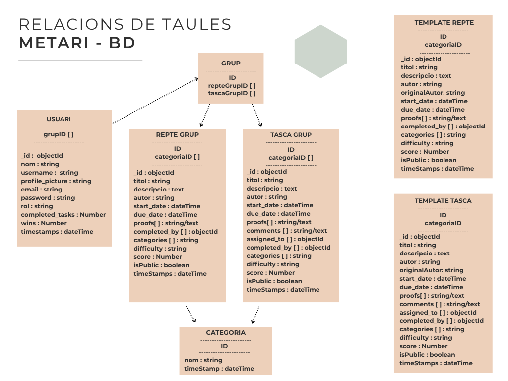

# Estudi previ

# 1. Descripció del sistema

**Nom del projecte:** Metari

**Idea:**

Metari és una plataforma comunitària de reptes i gestió de tasques.

Els usuaris poden crear i unir-se a grups. 

Els usuaris que siguin administradors de grup poden gestionar els membres, crear i validar els reptes i opcionalment compartir el repte amb la comunitat, permitint que altres grups puguin utilitzar aquest repte.

Dins dels grups hi haurà un sistema de puntuació entre els diferents usuaris en funció de quins reptes o tasques validats per l'administador del grup ha completat l'usuari.

També hi haurà un sistema d'amics amb un ranking exclusivament entre tú i els teus amics.

L'administrador pot gestionar usuaris, grups, categòries, reptes, tasques i comentaris.

L'usuari pot crear i unir-se a grups, cercar-los per nom o categòria i afegir amics.

L'usuari administrador de grup té control total sobre el grup, pot publicar i gestionar tasques o reptes, gestionar els usuaris o eliminar el grup.

El convidat pot veure grups públics i el seu contingut però no podrà interactuar amb ell (no pot enviar proves de que ha completat el repte o tasca, no pot unir-se a grups ni afegir comentaris).

L'objectiu de l'aplicació és oferir una plataforma intuitiva i interactiva per gestionar tasques o competir amb els teus amics o altres usuaris dins de l'aplicació mitjançant grups.

---

# 2. Requisits del sistema

### Requisits funcionals

| Codi | Descripció               |
| ---- | -------------------------|
| RF1  | Registrar usuaris        |
| RF2  | Iniciar sessió           |
| RF3  | Crear grups              |
| RF4  | Crear reptes/tasques/categories     |
| RF5  | Crear comentaris NOMÉS en la tasca (útil per aclarar dubtes)     |
| RF6  | Administrar reptes/tasques              |
| RF7  | Inscriure's a un grup    |
| RF8  | Cercar grup per nom o categories    |
| RF9  | Administrar un grup (usuari de grup)
| RF10  | Adjunció de proves (per demostrar que el repte s'ha completat)      |
| RF11  | Sistema de puntuació del grup (rànquing)
| RF12 | Sistema d'amics
| RF13 | Sistema de puntuació entre amics
| RF14 | Personalització bàsica del perfil (canvi de nom visible, canvi de username, canvi de correu, canvi de contrasenya, canvi de foto de perfil)
| RF15 | Administrar usuaris
| RF16  | Administrar grups (tots els grups de l'aplicació)
| RF17  | Administrar/validar reptes (totes les tasques de l'aplicació que es vulguin compartir amb la comunitat)
| RF18  | Administrar categories      |

---

### Requisits no funcionals

| Categoria      | Requisit                                       |
| -------------- | ---------------------------------------------- |
| Seguretat      | Validació de camps, contrasenyes encriptades, ús de la llibreria Helmet per evitar vulnerabilitats comuns dels navegadors.                                               |
| Rendiment      |   Intentar que el temps de resposta de les peticions a l'API es realitzin el més ràpid possible.                                             | 
| Usabilitat     |  Interfície Responsive i intuitiva.                                              | 
| Disponibilitat |  Disponible 24 hores els 7 dies de la setmana excepte  quan estigui en manteniment.
| Notificacions | Sistema de notificacions bàsic (correu electrònic Nodemailer).                                            | 

---

# 4. Model de negoci

## Actors del sistema

| Actor            | Accions Principals                         |
| ---------------- | ----------------------------------- |
| Guest            |  Pot veure grups públics i el seu contingut però no podrà interactuar amb ell. |
| Usuari                 | Pot unir-se i crear grups, afegir amics, crear tasques, reptes i categòries per a la comunitat i administrar el seu perfil.    |
| Usuari administrador de grup  | Mateixos permisos que l'usuari, però aquest pot administrar els grups dels quals és propietari o administrador (publicar tasques i reptes, crear categòries només per els seus grups, administrar membres i configuracions del grup.) |
|  Admin    | Control total de l'aplicació. Modera grups, tasques, reptes, categòries i usuaris. |

## Diagrama de casos d'ús 

### Lectura ràpida del diagrama

- **Visitant**: Pot consultar grups i rankings, cercar-los i crear un compte.

- **Usuari registrat**: Pot iniciar sessió, gestionar el seu perfil, unir-se a grups, crear grups, crear reptes/tasques/categories dins dels grups als que pertany, afegir comentaris i afegir proves.

- **Usuari Administrador/Owner**: Mateixos permisos que l'usuari registrat, però dins del grup poden admnistrar totes les tasques i reptes que es publiquen (editar-les i eliminar-les) i administrar el grup (canviar el nom, canviar categories, administrar els membres (canviar el seu rol o expulsar-los, excepte l'owner), L'owner té control total del grup (incloent eliminació).)

- **Administrador**: Control total de l'aplicació. Pot administrar usuaris, tots els grups i administrar tasques, reptes i categories públiques.

Els permisos són acumulatius (Role Based Access Control (RBAC)), els rols superiors hereden les funcions dels inferiors.

Aquest diagrama es pot adaptar fàcilment a altres temàtiques canviant actors i casos d'ús principals.
# 3. Model conceptual (simplificat)

## Entitats principals:

Usuari

- _id (MongoID)
- nom
- username
- profile_picture
- email
- password
- rol (User/Admin)
- completed_tasks
- wins (reptes guanyats)
- grups[] (many to many)
- friends[]
- timestamps

Grup

- _id (MongoID)
- nom
- tasques[]
- reptes[]
- categories[] (adicional/extra)
- membres[]
- admins[]
- owner
- isPublic (boolean)
- timestamps

Tasca

- _id (MongoID)
- titol
- descripcio
- author
- start_date
- due_date
- proofs[
    {
        userId,
        filename
    }
]
- comments [
    {
        userId,
        body,
        timestamps
    }
]
- categories[]
- assigned_to[]
- completed_by[]
- difficulty
- score
- isPublic (boolean)
- timestamps

Tasca_Template

- _id (MongoID)
- titol
- descripcio
- author (default null)
- originalAuthor
- start_date (default null)
- due_date (default null)
- proofs[] (empty array)
- comments [] (empty array)
- categories[]
- assigned_to[] (empty array)
- completed_by[] (empty array)
- difficulty
- score
- isPublic (boolean) (default false)
- timestamps

Repte

- _id (MongoID)
- titol
- descripcio
- author
- start_date
- due_date
- proofs[
    {
        userId,
        filename
    }
]
- categories[]
- completed_by[]
- difficulty
- score
- isPublic (boolean)
- timestamps

Repte_Template

- _id (MongoID)
- titol
- descripcio
- author (default null)
- originalAuthor
- start_date (default null)
- due_date (default null)
- proofs[] (empty array)
- categories[]
- completed_by[] (empty array)
- difficulty
- score
- isPublic (boolean) (default false)
- timestamps

Categoria

- _id (MongoID)
- nom
- timestamps

Relacions:

Com la base de dades la farem a MongoDB no compta com a tal amb un sistema relacional, però amb arrays i referenciant IDs podem relacionar diversos documents.

Metari comptarà amb les següents relacions:

- **Usuari -> Grup:** Un usuari pot estar en diferents grups (document Usuari, camp groups[]). Un grup pot tenir diversos usuaris (document Grups, camps membres[], admins[] i owner, per diferenciar usuaris sense permisos dins del grup, usuaris amb privilegis i el creador del grup, que per defecte també estarà al llistat d'administradors).

- **Usuari -> Tasca:** Un usuari pot ser autor de diferents tasques, però la tasca només pot tenir un autor (document Tasca, camp author). Una tasca pot tenir diferents usuaris assignats (document Tasca, camp assigned_to[]).

- **Usuari -> Tasca_Template:** Un usuari pot ser autor de diferents templates de tasques al compartir-les amb la comunitat, però la template de la tasca només pot tenir un autor (document Tasca_Template, camp originalAuthor).

- **Usuari -> Repte:** Un usuari pot ser autor de diferents reptes, però el repte només pot tenir un autor (document Repte, camp author).

- **Usuari -> Repte_Template:** Un usuari pot ser autor de diferents templates de reptes al compartir-los amb la comunitat, però el repte només pot tenir un autor (document Repte_Template, camp originalAuthor).

- **Grup -> Tasques:** Un grup pot tenir diferents tasques (document Grup, camp tasques[]).

**Grup -> Reptes:** Un grup pot tenir diferents reptes (document Grup, camp reptes[]).

**Categoria -> Grup:** Un grup pot tenir diverses categories (camp categories[]).

**Categoria -> Tasca:** Una tasca pot tenir diverses categories (document Tasca, camp categories[]).

**Categoria -> Repte:** Un repte pot tenir diverses categories (document Repte, camp categories[]).

## Model de dades

## Lectura ràpida del model de dades

- Un usuari representa qualsevol persona registrada al sistema.

- Un usuari pot consultar, cercar, unir-se i crear grups.

- Un usuari pot consultar rànquings.

- Un usuari pot afegir amics.

- Un usuari pot crear tasques, reptes i categories dins dels grups on és membre.

- Les tasques i reptes tenen categories assignades.

- Un usuari pot compartir tasques o reptes i per tant és autor de les templates.

- Els grups tenen membres, administradors, un propietari, reptes, tasques i categories.

- Un usuari pot editar totes les tasques que siguin seves dins dels seus grups.

- Un usuari pot adjuntar proves de que ha completat la tasca o repte i comentaris dins les tasques.

- Un usuari adminstrador (no owner) pot administrar totes les tasques del grup.

- Un usuari administrador pot administrar el grup, canviant el seu nom, les categories, i gestionant els altres membres del grup (poden alternar el seu rol entre membre del grup o administrador o expulsar-lo. no poden gestionar l'owner).

- L'owner del grup té control total sobre el grup.

---

# 5. Disseny inicial de la interfície (bàsic)

Pantalles principals:

- Pàgina d'inici ()
- Detall d'esdeveniment
- Panells d'usuaris
- Formulari de creació
- Formularia de login
  
Exemple: 

---

# 6. Tecnologies utilitzades

**MERN Stack**

Frontend

- React (TypeScript)
- CSS
- Bootstrap

Backend

- Express JS
- API RESTful

Base de dades

- MongoDB
- Model de referències (Camp adicional per referenciar el document extern)

Autenticació

- bcrypt -> Hash de contrasenyes
- JWT (JSONWebToken) -> Autenticació

Pujada de fitxers

- Multer

## Diagrama d'arquitectura 

---

# 7. Planificació inicial

| Fase | Descripció   |
| ---- | ------------ |
| 1    | Estudi previ |
| 2    | Backend API  |
| 3    | Frontend     |
| 4    | Integració   |
| 5    | Proves       |
| 6    | Documentació |
| 7    | Desplegament |