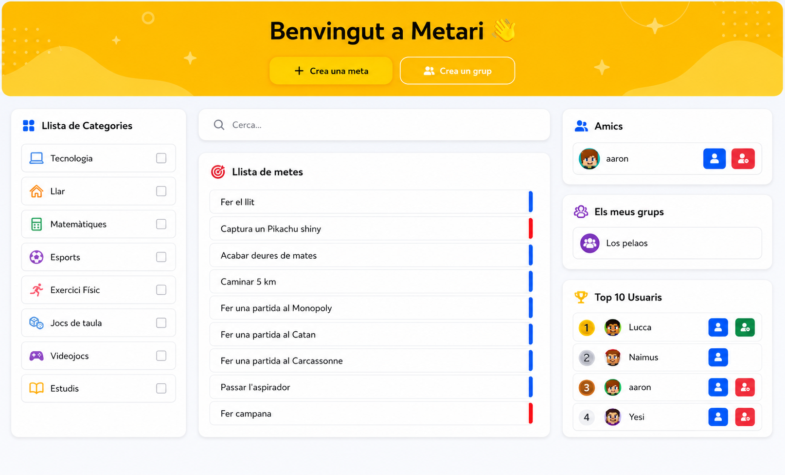

# Metari - Estudi previ

## Índex

1. [Descripció del sistema](#1-descripció-del-sistema)
2. [Requisits del sistema](#2-requisits-del-sistema)
   - 2.1 [Requisits funcionals](#requisits-funcionals)
   - 2.2 [Requisits no funcionals](#requisits-no-funcionals)
3. [Model de negoci](#3-model-de-negoci)
   - 3.1 [Actors del sistema](#actors-del-sistema)
   - 3.2 [Diagrama de casos d'ús](#diagrama-de-casos-dús)
4. [Model conceptual (simplificat)](#4-model-conceptual-simplificat)
   - 4.1 [Canvis respecte al model original](#41-canvis-respecte-al-model-original)
5. [Disseny inicial de la interfície (bàsic)](#5-disseny-inicial-de-la-interfície-bàsic)
6. [Tecnologies utilitzades](#6-tecnologies-utilitzades)
7. [Planificació inicial](#7-planificació-inicial)
8. [Possibles millores](#8-possibles-millores)

# 1. Descripció del sistema

**Nom del projecte:** Metari

**Idea:**

Metari és una plataforma comunitària de reptes i gestió de tasques.

L'objectiu de l'aplicació és oferir una plataforma intuitiva i interactiva per gestionar tasques o competir amb els teus amics o altres usuaris dins de l'aplicació mitjançant grups.

**Convidat:**

- El convidat pot veure grups públics i el seu contingut però no podrà interactuar amb ell (no pot enviar proves de que ha completat el repte o tasca, no pot unir-se a grups ni afegir comentaris), també pot cercar-los per nom i categoria.

**Usuari registrat:**

- L'usuari pot crear i unir-se a grups, crear tasques o reptes dins dels grups als que pertany, opcionalmet compartir-los amb la comunitat, cercar grups per nom o categòria, afegir amics i personalitzar el seu perfil.

**Sistema d'amics:**

- El sistema d'amics comptarà amb un sistema de puntuació exclusiu de l'usuari registrat i el seu llistat d'amics.

- El sistema de puntuació de cada perfil d'usuari es basa en quants reptes han guanyat i quantes tasques han completat. En base a aquests paràmetres es monta el sistema de puntuació entre amics.

**Grups:**

- Dins dels grups es publicaran tasques o reptes.

- Dins dels grups hi haurà un sistema de puntuació entre els diferents usuaris en funció de quins reptes o tasques validats pels moderadors del grup ha completat l'usuari.

- Es poden adjuntar proves als reptes i tasques per demostrar que s'han completat. Gràcies a aquestes proves, el creador de la tasca o repte o qualsevol moderador podrà marcar que l'usuari ha completat el repte o tasca.

**Usuari moderador de grup:**

- Els usuaris que siguin moderadors de grup poden gestionar els membres, validar tots els reptes, i canviar el nom del grup i les seves categories.

**Usuari propietari del grup (owner):**

- L'usuari propietari de grup (owner) té control total sobre el grup, mateixos permisos que el moderador del grup però amb la diferència de que pot eliminar el grup.

- Si es vol sortir del grup, pot assignar un nou propietari.

**Admin de l'aplicació:**

- L'administrador de l'aplicació pot gestionar usuaris, grups, categòries, reptes, tasques i comentaris. Té control total de l'aplicació.

---

# 2. Requisits del sistema

### Requisits funcionals

| Codi | Descripció                                                                                                                                  |
| ---- | ------------------------------------------------------------------------------------------------------------------------------------------- |
| RF1  | Registrar usuaris                                                                                                                           |
| RF2  | Iniciar sessió                                                                                                                              |
| RF3  | Crear grups                                                                                                                                 |
| RF4  | Crear metes i categories                                                                                                                    |
| RF5  | Crear comentaris (útil per aclarar dubtes)                                                                                                  |
| RF6  | Administrar reptes/tasques                                                                                                                  |
| RF7  | Inscriure's a un grup                                                                                                                       |
| RF8  | Sortir d'un grup                                                                                                                            |
| RF9  | Cercar grup per nom o categories                                                                                                            |
| RF10 | Administrar un grup (usuari moderador de grup)                                                                                              |
| RF11 | Adjunció de proves (per demostrar que el repte s'ha completat)                                                                              |
| RF12 | Sistema de puntuació del grup (rànquing)                                                                                                    |
| RF13 | Sistema d'amics                                                                                                                             |
| RF14 | Sistema de puntuació entre amics                                                                                                            |
| RF15 | Personalització bàsica del perfil (canvi de nom visible, canvi de username, canvi de correu, canvi de contrasenya, canvi de foto de perfil) |
| RF16 | Administrar usuaris                                                                                                                         |
| RF17 | Administrar grups (tots els grups de l'aplicació)                                                                                           |
| RF18 | Administrar/validar reptes (totes les tasques de l'aplicació que es vulguin compartir amb la comunitat)                                     |
| RF19 | Administrar categories                                                                                                                      |

---

### Requisits no funcionals

| Categoria      | Requisit                                                                                                                   |
| -------------- | -------------------------------------------------------------------------------------------------------------------------- |
| Seguretat      | Validació de camps, contrasenyes encriptades, ús de la llibreria Helmet per evitar vulnerabilitats comuns dels navegadors. |
| Rendiment      | Intentar que el temps de resposta de les peticions a l'API es realitzin el més ràpid possible.                             |
| Usabilitat     | Interfície Responsive i intuitiva.                                                                                         |
| Disponibilitat | Disponible 24 hores els 7 dies de la setmana excepte quan estigui en manteniment.                                          |
| Notificacions  | Sistema de notificacions bàsic (correu electrònic Nodemailer).                                                             |

---

# 3. Model de negoci

## Actors del sistema

| Actor                             | Accions Principals                                                                                                                                                                                                                                                      |
| --------------------------------- | ----------------------------------------------------------------------------------------------------------------------------------------------------------------------------------------------------------------------------------------------------------------------- |
| Guest                             | Pot veure grups públics i el seu contingut però no podrà interactuar amb ell. També pot cercar-los, però conservant la restricció d'interacció.                                                                                                                         |
| Usuari                            | Pot unir-se i crear grups, afegir amics, crear tasques, reptes i categòries dins del grup i opcionalment compartir-los amb la comunitat i administrar el seu perfil.                                                                                                    |
| Usuari moderador de grup          | Mateixos permisos que l'usuari, però aquest pot administrar els grups dels quals és moderador, valida el contingut del grup (tasques i reptes que publiquen els usuaris), afegir i eliminar usuaris (excepte el propietari/creador del grup) i canviar el nom del grup. |
| Usuari propietari de grup (owner) | Mateixos permisos que l'usuari moderador de grup, però aquest té control total de tots els grups on és propietari i pot eliminar el grup i canviar el propietari en cas d'abandonar un grup.                                                                            |
| Admin                             | Control total de l'aplicació. Modera grups, tasques, reptes, categòries i usuaris.                                                                                                                                                                                      |

## Diagrama de casos d'ús

### Lectura ràpida del diagrama

- **Visitant**: Pot consultar grups i rankings, cercar-los i crear un compte.

- **Usuari registrat**: Pot iniciar sessió, gestionar el seu perfil, unir-se a grups, crear grups, crear reptes/tasques/categories dins dels grups als que pertany, afegir comentaris i afegir proves.

- **Usuari Moderador/Owner**: Mateixos permisos que l'usuari registrat, però dins del grup poden admnistrar totes les tasques i reptes que es publiquen (editar-les i eliminar-les) i administrar el grup (canviar el nom, canviar categories, administrar els membres (canviar el seu rol o expulsar-los, excepte l'owner), L'owner té control total del grup (incloent eliminació).)

- **Administrador**: Control total de l'aplicació. Pot administrar usuaris, tots els grups i administrar tasques, reptes i categories públiques.

Els permisos són acumulatius (Role Based Access Control (RBAC)), els rols superiors hereden les funcions dels inferiors.

# 4. Model conceptual (simplificat)

## Entitats principals:

**User**

- id
- nom
- username
- email
- password
- role (enum("User", "Admin")) (default: "User") (Distingueix entre usuari registrat i administrador de l'aplicació)
- completed_tasks (Comptador de tasques completades)
- score (Puntuació que es suma dels reptes que ha completat)
- restore_token (Token temporal per restaurar la contrasenya).
- created_at
- updated_at

**Group**

- id
- name
- description
- owner_id (FK → users.id) (Propietari del grup)
- is_public (Indica si el grup és públic o privat)
- created_at
- updated_at

**Meta** (objectiu) (entitat general per a reptes i tasques)

- id
- title
- description
- author_id (FK → users.id) (autor de la tasca o repte)
- group_id (FK → users.id) (autor de la tasca o repte)
- type (enum("challenge", "task")) (Indica si el tipus de meta és un repte o una tasca)
- created_at
- updated_at

**Category**

- id
- name
- description
- created_at
- updated_at

## Relacions Many to Many

**category_meta** (Permet assignar varies categories a varies meta)

- category_id (PK),
- meta_id (PK),
- created_at
- updated_at

**group_user** (Membres de cada grup i els seus rols dins d'aquests)

- group_id (PK, FK → groups.id)
- user_id (PK, FK → users.id)
- role (enum("member", "moderator")) (Rol de l’usuari dins del grup)

**Assignations** (Assignacions de metes a usuaris i grups)

- id
- group_id (A quin grup pertany aquesta assignació)
- meta_id (Quina meta està involucrada en aquesta assignació)
- user_id (A quin usuari s'ha assignat la meta, només si és de tipus tasca, ja que els reptes són de tot el grup).
- start_date (Data d'inici de l'assginació, és interessant que sigui una propietat de l'assignació ja que en cas de tornar la meta pública no quadraria que tingués la mateixa data en cas de per exemple publicar-la una setmana després en un altre grup, el mateix passa amb due_date).
- due_date (Data de venciment de la meta).
- priority (enum("high", "low"))
  difficulty (enum("easy", "normal", "hard", "extreme"))
  score
  completed (Indica si la tasca ha estat completada)
  created_at
  updated_at

Comportament:

- Si meta.type = "task" → assignació individual (user_id obligatori)
- Si meta.type = "challenge" → assignació grupal (user_id pot ser NULL)

**Comments** (Comentaris sobre assignacions)

- id
- assignation_id (FK → assignations.id)
- user_id (FK → users.id)
- body (Text del comentari)
- created_at
- updated_at

**Proofs** (Evidència de que la meta ha estat completada)

- id
- assignation_id (FK → assignations.id)
- user_id (FK → users.id)
- proof (URL o ruta de l’arxiu)
- is_valid (Indica si la prova ha estat validada)
- created_at
- updated_at

Comportament:

- Per tasques:
  - Quan is_valid = true → es marca assignations.completed = true
- Per reptes:
  - Permet saber quins usuaris han completat el repte dins del grup

**Invitations** (Invitacions d'amistat o d'unió a un grup)

- id
- sender_id (FK → users.id)
- receiver_id (FK → users.id)
- group_id (FK → groups.id)
- status (enum("pending", "accepted", "rejected"))
- created_at
- updated_at

**Index** (Ternaria entre usuaris, metes i grups)

- id
- user_id (FK → users.id)
- meta_id (FK → metas.id)
- group_id (FK → groups.id)
- is_public
- is_approved
- is_community_approved

Serveix com a sistema de:

- moderació
- visibilitat
- validació comunitària

## Model de dades

## Lectura ràpida del model de dades

Un usuari pot crear cap o molts grups.

Un usuari pot pertànyer a cap o a molts grups.

Cap o molts usuaris poden administrar cap o molts grups.

Un usuari pot enviar i rebre cap o moltes invitacions per a un grup (relació ternària central).

Un usuari pot ser l'autor de cap o moltes metes.

Un grup o molts grups poden contenir cap o moltes metes.

Una meta pot estar indexada en un grup sota la verificació d'un usuari (relació ternària inferior).

Una meta ha de tenir, com a mínim, una o més categories.

Una categoria pot estar assignada a cap o a moltes metes.

Un usuari pot tenir assignades cap o moltes metes (relació ternària superior).

Una assignació (vinclada a una meta i un usuari) pot rebre cap o molts comentaris.

Un usuari pot escriure cap o molts comentaris en una assignació.

Una assignació pot tenir vinculades cap o moltes proves (proofs).

Un usuari pot realitzar cap o moltes proves per a una assignació concreta.

---

## 4.1 Canvis respecte al model original

**Meta**

- Camps afegits: `is_public`, `category_id`

**Assignation**

- Camps afegits: `assigner_id`, `needs_proofs` 

**Proof**

- Camps afegits: `proof_type`

**Index** (IndexedMeta)

- Camps eliminats: `group_id`, `is_public`

**AssignationCompletions** — Nova taula

- Camps: `id`, `user_id`, `assignation_id`, `is_Completed`

- Gestiona complecions individuals per a challenges de grup

# 5. Disseny inicial de la interfície (bàsic)

Per visualitzar millor com volem que sigui el frontend de Metari, hem especificat les principals pàgines i components en el [següent document](wireframe/planificacio-wireframe.md).

També hem realitzat un wireframe amb **Figma** per poder exemplificar millor com volem que es vegi el nostre frontend.

**Home**:

**Profile**:

**Register, Login, Forgot Password i Restore Password forms**:

**Pàgina de grup (+ panell admin grup)**:

**Panell d'administrador**:

**Diseny orientatiu final**:

---

# 6. Tecnologies utilitzades

**MERN Stack** (utilitzant MariaDB)

Frontend

- **Framework:** React (TypeScript) amb Vite
- **Estils:** CSS, Bootstrap
- **Routing:** react-router-dom
- **HTTP Client:** Axios
- **Validació:** Zod

Backend

- **Framework:** Express JS
- **API:** RESTful
- **ORM:** [Prisma](https://www.prisma.io/orm)
- **Seguretat:** Helmet, CORS

Base de dades

- **BBDD:** MariaDB

Autenticació

- **Hash de contrasenyes:** bcrypt
- **Tokens:** JWT (JSONWebToken)

Pujada de fitxers

- **Middleware:** Multer

Correu electrònic

- **Notificacions:** Nodemailer

Eines de desenvolupament

- **Gestor de processos:** Nodemon (reinici automàtic en desenvolupament)
- **Variables d'entorn:** Dotenv

## Diagrama d'arquitectura

---

# 7. Planificació inicial

| Fase | Descripció   |
| ---- | ------------ |
| 1    | Estudi previ |
| 2    | Backend API  |
| 3    | Frontend     |
| 4    | Integració   |
| 5    | Proves       |
| 6    | Documentació |
| 7    | Desplegament |

**Nota**: És possible que algunes fases del projecte s'hagin de realitzar a l'hora, per exemple, desenvolupar el backend i provar-ho o documentar mentre es desplega per tenir documentat com s'executa en local i com es posa en producció.

# 8. Possibles millores
Degut a les restriccions de temps a l'hora de fer el projecte, no s'han pogut desenvolupar algunes de les funcionalitats desitjades.

**Millores funcionals:**

- Organització avançada de metes: filtrar i ordenar per dates, prioritat o dificultat, i mostrar un calendari amb les tasques a complir.

- Paginació a les llistes de metes, grups, usuaris i categories.

- Fer el sistema de puntuació de grups més robust i millorar l'experiència de l'usuari a l'hora de comparar punts amb altres membres.

- Historial de seguiment de les tasques completades, tant per grup com per usuari.

- Millorar panell d'estadístiques (gràfics de progrés, percentatge de completats, puntuació personal per grup, dies consecutius de complecions...).

- Reportar usuaris o contingut inapropiat.

- Pujada de foto de perfil personalitzada. Per temps hem hagut de retallar contingut i no hem implementat aquesta funcionalitat.

- Ordenar rankings per tasques completades. D'aquesta forma podem veure quins usuaris han completat més tasques i quins usuaris tenen més puntuació.

- Rankings interns de grup i rankings de tu i els teus amics en el perfil o a la home de forma similar a com surt el Top 10 Usuaris.

- Comprovació de dates d'inici i de finalització a l'hora de comptar la puntuació o a l'hora de poder marcar-les com a completada o llistar-les en les assignacions. En aquesta versió del projecte només són dades informatives, però podria ser comode a l'hora de gestionar-les.

**Millores d'estil:**

- Pàgina de presentació: una introducció explicant de què tracta la plataforma abans d'entrar a l'aplicació.

- L'opció de canviar la paleta de colors de la plataforma (alguns elements de l'aplicació ja tenen colors per variable preparats per aquesta funcionalitat).

**Millores tècniques:**

- CI/CD per desplegament automàtic
- Documentació de l'API amb Swagger

